# DOCUMENTATION

## Step 1: APACHE INSTALLATION

#### Command: sudo apt update (Packages update in Package Manager)
#### Output:

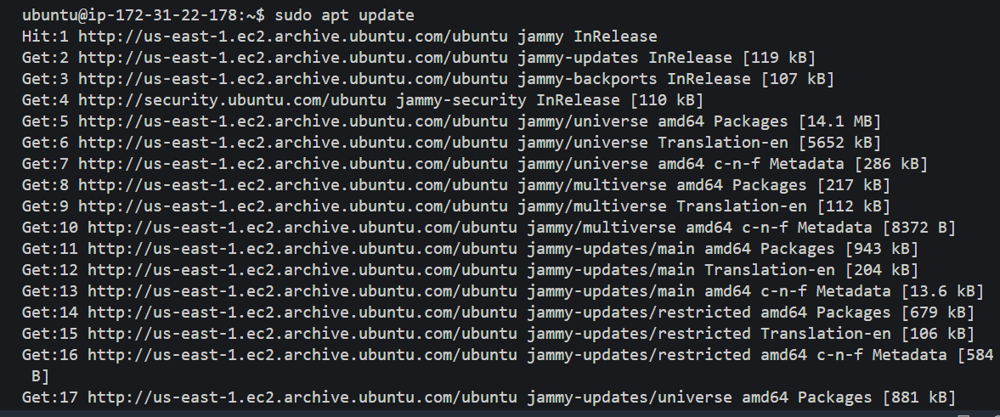

#### Command: sudo apt install apache2 (Apache 2 Installation)
#### Output:

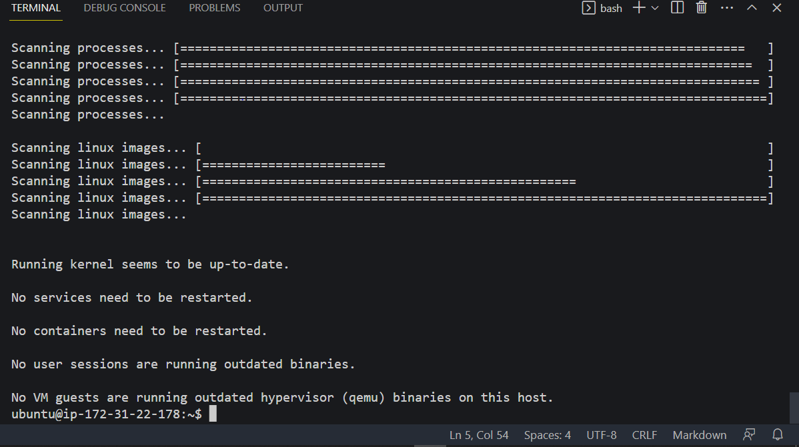

#### Command: sudo systemctl status apache2 (Apache Status Confirmation)
#### Output:

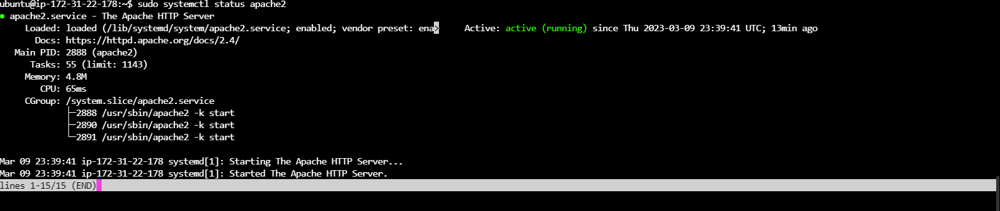

#### Command:  curl http://127.0.0.1:80 (Using curl to access server via IP address)
#### Output:

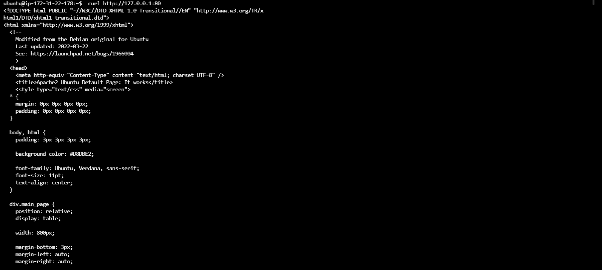

#### Command:  http://100.26.144.182/ (Accessing IP address via browser)
#### Output:

## PROJECT-1 GIT INITIALIZATION AND FIRST COMMIT i.e running git commit for Step 1.

#### Command:  git init & git status (Project-1 git initialization and check status to see changes)
#### Output:

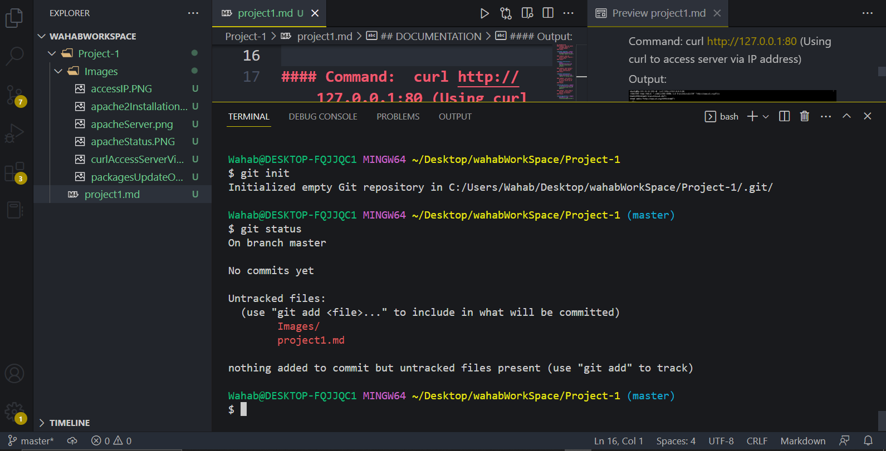

#### Commands:  git add . | git status | git commit (Staging and commiting files)
#### Outputs:

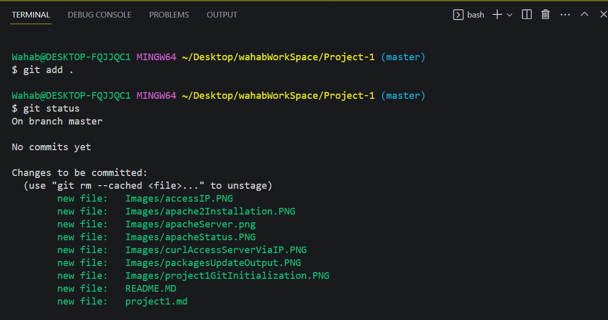

## Step 2: MYSQL INSTALLATION

#### Command: sudo apt install mysql-server (Mysql Installation)
#### Output:

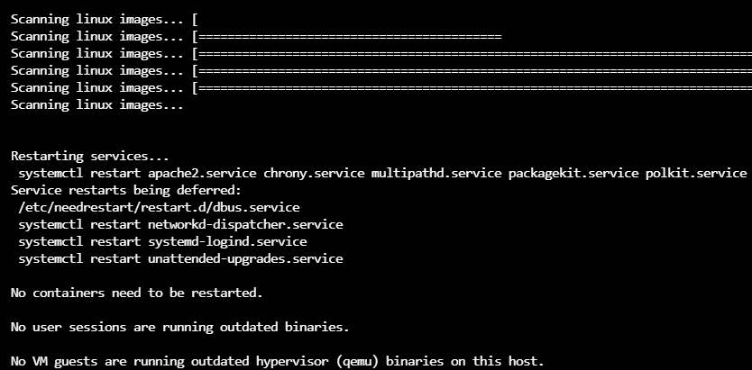

#### Command: $ sudo mysql (Mysql Installation)
#### Output:

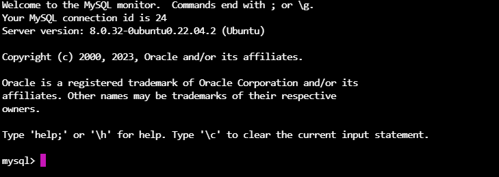

#### Command: $ sudo mysql_secure_installation (Mysql Installation)
#### Output:

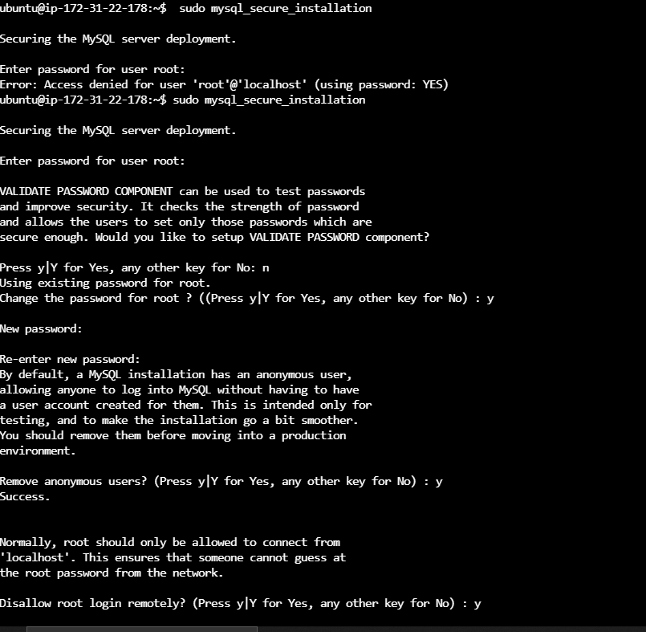

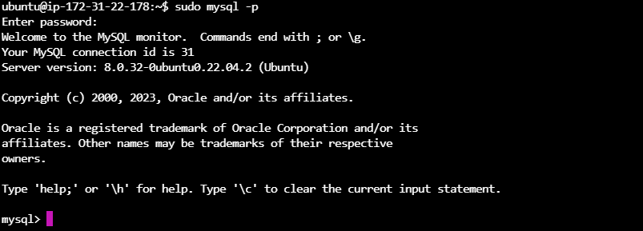

## PROJECT-1 git commit for Step 2. 

#### Commands:  git add . |  git commit (Staging and commiting files)
#### Outputs:

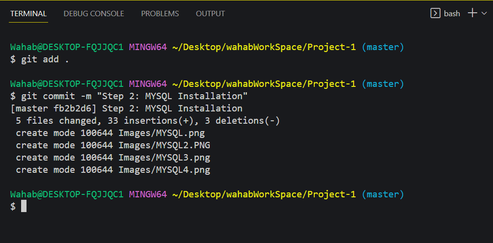

## Step 3: PHP INSTALLATION

#### Command: $ sudo apt install php libapache2-mod-php php-mysql (Php and other packages Installation)
#### Output:

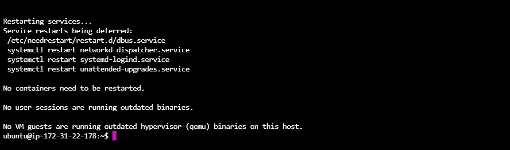

#### Command: $ php -V (Php  Installation Confirmation)
#### Output:

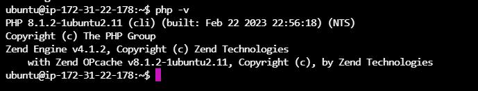

## PROJECT-1 git commit for Step 3.

#### Commands:  git add . |  git commit (Staging and commiting files)
#### Outputs:

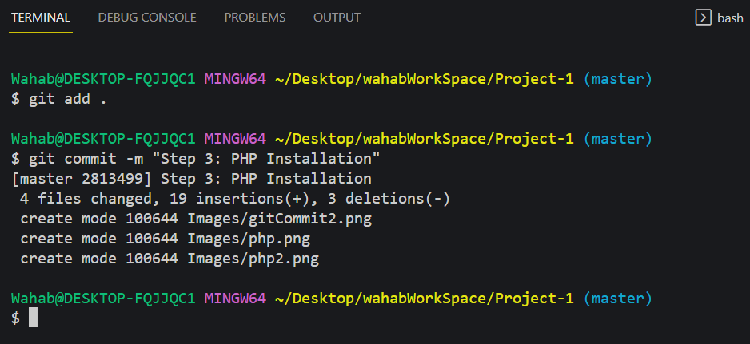

## Step 4: CREATING VIRTUAL HOST FOR WEBSITE USING APACHE

#### Command:  sudo vi /etc/apache2/sites-available/projectlamp.conf (Creating a config file)
#### Output:

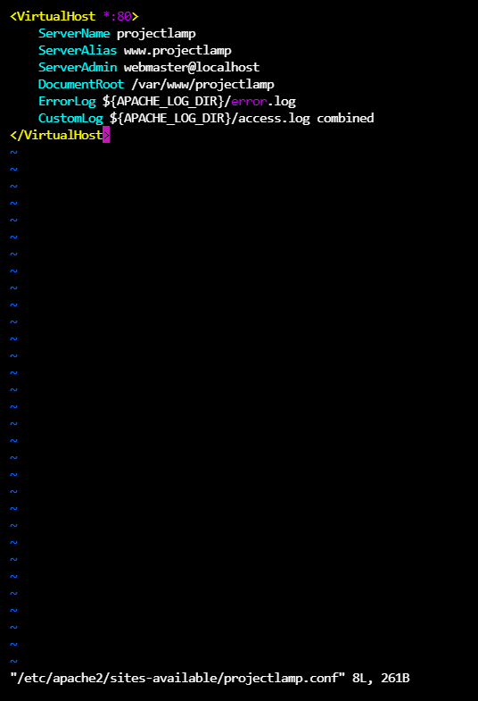

#### Commands:  sudo a2ensite projectlamp, sudo a2dissite 000-default and sudo systemctl reload apache2 (Enabling Virtrual Host, disabling apache default websit and reloading apache)
#### Output:

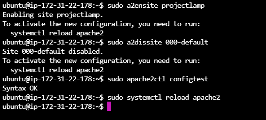

#### Commands:  sudo echo 'Hello LAMP from hostname' $(curl -s http://169.254.169.254/latest/meta-data/public-hostname) 'with public IP' $(curl -s http://169.254.169.254/latest/meta-data/public-ipv4) > /var/www/projectlamp/index.html (create index.html with content)
#### Output:

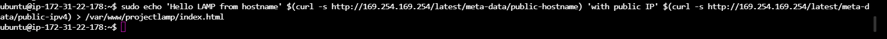

#### Commands: http://100.26.144.182/  (website is up and running)
#### Output:

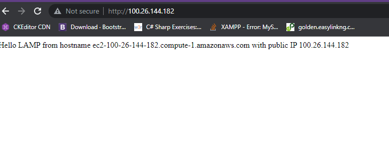

## Step 4: ENABLE PHP ON WEBSITE

#### Commands: sudo vim /etc/apache2/mods-enabled/dir.conf (changing the order of index.php)
#### Output:

#### Commands:  vim /var/www/projectlamp/index.php (create index.php with content)
#### Output:

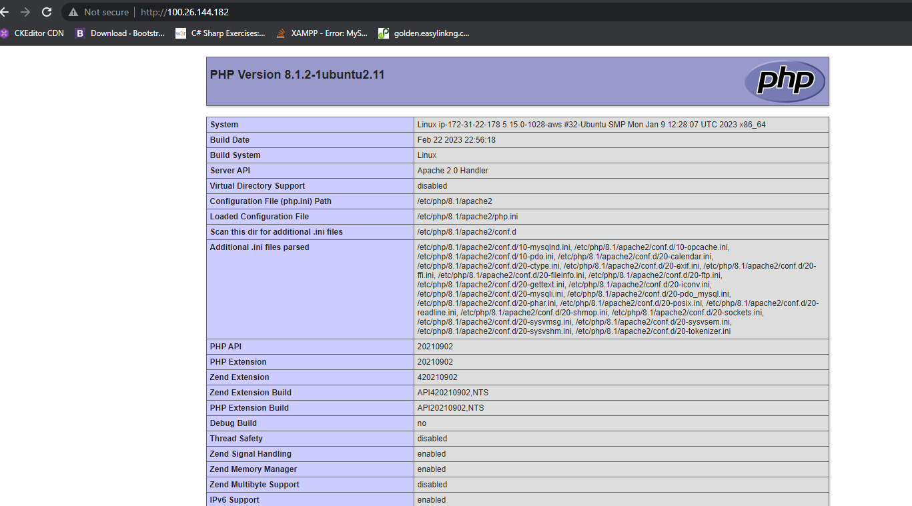
