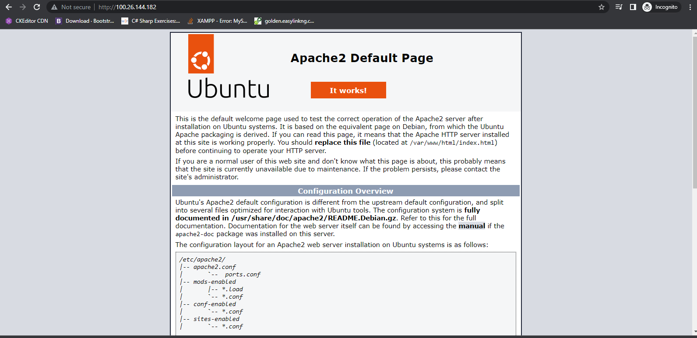
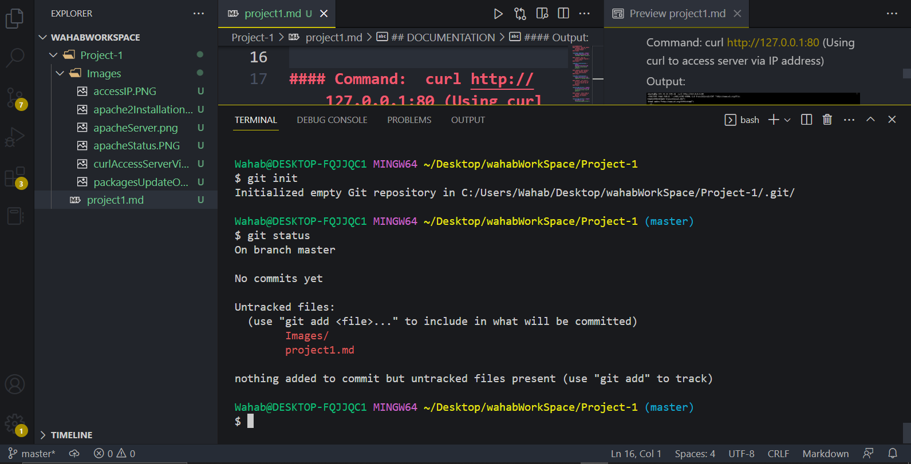
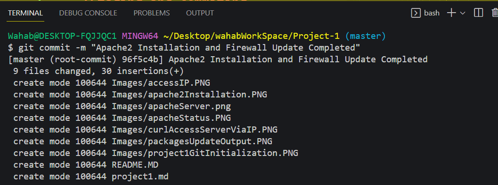

## DOCUMENTATION
#### Command: sudo apt update (Packages update in Package Manager)
#### Output:

#### Command: sudo apt install apache2 (Apache 2 Installation)
#### Output:

#### Command: sudo systemctl status apache2 (Apache Status Confirmation)
#### Output:

#### Command:  curl http://127.0.0.1:80 (Using curl to access server via IP address)
#### Output:

#### Command:  http://100.26.144.182/ (Accessing IP address via browser)
#### Output:

#### Command:  git init & git status (Project-1 git initialization and check status to see changes)
#### Output:

#### Command:  git add . | git status | git commit (Staging and commiting files)
#### Output:

